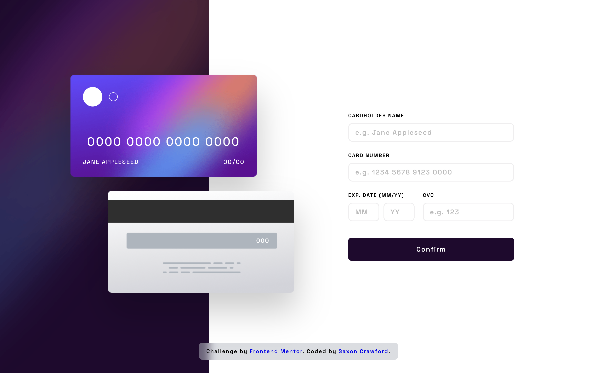

# Frontend Mentor - Interactive card details form solution

This is a solution to
the [Interactive card details form challenge on Frontend Mentor](https://www.frontendmentor.io/challenges/interactive-card-details-form-XpS8cKZDWw).
Frontend Mentor challenges help you improve your coding skills by building realistic projects.

## Table of contents

- [Overview](#overview)
    - [The challenge](#the-challenge)
    - [Screenshot](#screenshot)
    - [Links](#links)
- [My process](#my-process)
    - [Built with](#built-with)
    - [What I learned](#what-i-learned)
    - [Continued development](#continued-development)
    - [Useful resources](#useful-resources)
- [Author](#author)

## Overview

### The challenge

Users should be able to:

- Fill in the form and see the card details update in real-time
- Receive error messages when the form is submitted if:
    - Any input field is empty
    - The card number, expiry date, or CVC fields are in the wrong format
- View the optimal layout depending on their device's screen size
- See hover, active, and focus states for interactive elements on the page

### Screenshot



### Links

- Solution URL: [GitHub to Solution](https://github.com/saxcrawford/interactive-card-form)
- Live Site URL: [Interactive Card Form](interactive-card-form-taupe.vercel.app)

## My process

### Built with

- Semantic HTML5 markup
- CSS custom properties
- Flexbox
- Mobile-first workflow
- JavaScript

**Note: These are just examples. Delete this note and replace the list above with your own choices**

### What I learned

### What I learned

This project helped me understand form validation, CSS custom properties, and responsive design patterns. Here are the
key takeaways:

**CSS Custom Properties for Theming:**

```css
:root {
    --color-purple: hsl(278, 94%, 30%);
    --color-red: hsl(0, 100%, 66%);
}
```

**Real-time Form Updates:**

```js
document.getElementById('card-number').addEventListener('input', () => {
    document.querySelector(".card-front-digits").textContent =
        form.elements["card-number"].value.replace(/\D/g, "")
            .replace(/(.{4})/g, "$1 ").trim();
});
```

**Mobile-First Responsive Design:**

```css
.card-section {
    max-width: 17.8125rem;
}

@media screen and (min-width: 1110px) {
    .card-section {
        max-width: 37.5rem;
        flex-direction: row;
    }
}
```

### Continued development

This project gave me more insight on manipulating information with JavaScript.
I look forward to using what I learned to continue building new projects and using more
advanced techniques for better responsive products.

### Useful resources

- [MDN Docs](https://developer.mozilla.org/en-US/) - The MDN Docs is one of the best places to get
- any information regarding JavaScript.

## Author

- Website - [Saxon Crawford](https://saxcrawford.github.io/portfolio-saxon/)
- Frontend Mentor - [@saxcrawford](https://www.frontendmentor.io/profile/saxcrawford)

